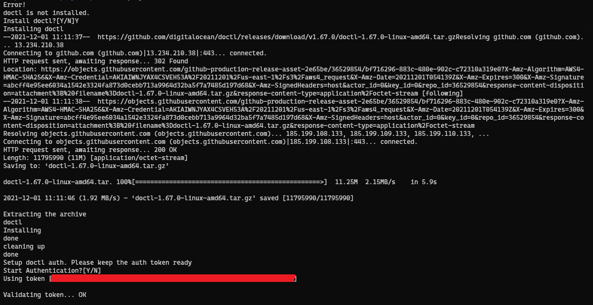
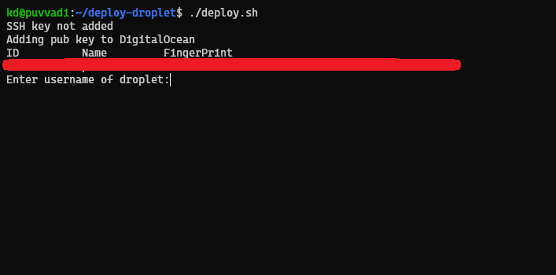
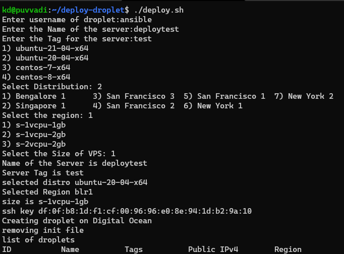

# Deploy DigitalOcean Droplets with shell

Deploy DigitalOcean Droplets with shell script using DigitalOcean CLI `doctl`


## Setting UP

To deploy this you need `doctl` installed and configured to run with token.

- script uses rsa public key `id_rsa` in your `~/.ssh/` directory. Also assumes that, the same key is added to your account or team account
- script uses cloud-init yaml config to add new user with `sudo` and disables `root` login from ssh.


## Deployment

To deploy this you need make `deploy.sh` exicutable.

```bash
chmod u+x deploy.sh
```

## RUN

To deploy this you need make deploy.sh exicutable.

```bash
chmod u+x deploy.sh
```

If the DigitalOcean cli `doctl` not installed, it'll prompt for installation. Enter `Y` and enter `RETURN` to install and setup authetication. 

If you've selected to go through the installation, please keep the DigitalOcean auth token ready. Paste the key when prompted. If the key is valid, installation will be completed and will go through `droplet` deployent. 

if you haven't already added `ssh key` in your `~/.ssh/id_rsa.pub`, key will be imported to DigitalOcean. 


## Support

This was a quick and dirty scipt i wrote to spin up the droplet. it's not perfect and there are better ways to do this but this works. That's all that matters.


## Screenshots

### If doctl not installed



### If Key not present



### Deployment



