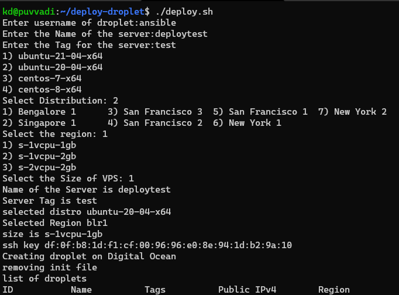

# Deploy DigitalOcean Droplets with shell

Deploy DigitalOcean Droplets with shell script using DigitalOcean CLI `doctl`


## Setting UP

To deploy this you need `doctl` installed and configured to run with token.

- script uses rsa public key `id_rsa` in your `~/.ssh/` directory. Also assumes that, the same key is added to your account or team account
- script uses cloud-init yaml config to add new user with `sudo` and disables `root` login from ssh.


## Deployment

To deploy this you need make `deploy.sh` exicutable.

```bash
chmod u+x deploy.sh
```

## Run

```bash
  ./deploy.sh
```


## Support

This was a quick scipt i wrote to spin up the droplet. it's not perfect and there are better ways to do this but this works. That's all that matters to me. 


## Screenshots



